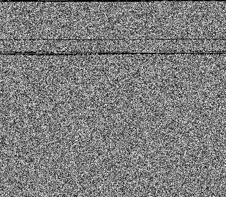
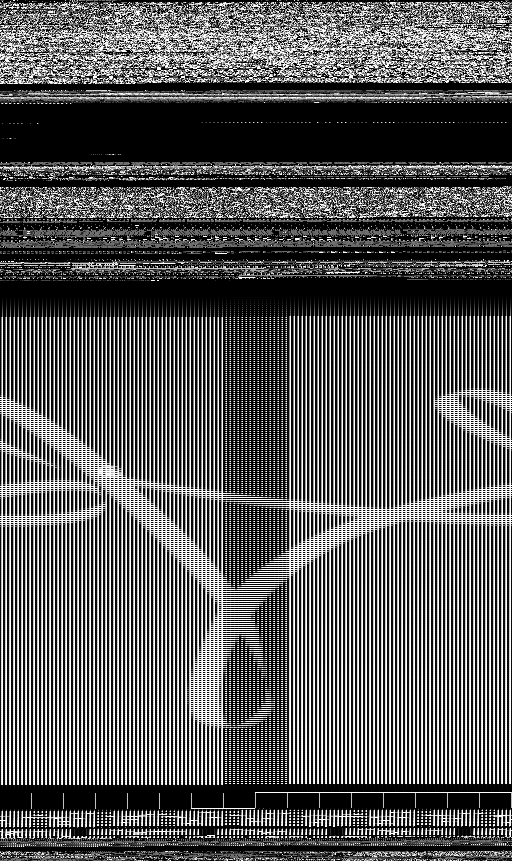

# The UTimg-VT-2020-05-WinEXE dataset <!--UTIMG-Drebin-AndroidDEX UTIMG-VT-2020-05-AndroidDEX-->

* To enable malware researchers to compare different classification approaches, we disclose how to create our dataset.

* This dataset contains 1,556 malware images from 18 different malware families. The original malware of the dataset are included in the VirusTotal malwere sample folder. 

* When your papers use the dataset or script-tools, please cite the following paper.

* R. Mitsuhashi and T. Shinagawa, <br>
"Exploring Optimal Deep Learning Models for Image-based Malware Variant Classification,"<br>
*2022 IEEE 46rd Annual Computer Software and Applications Conference (COMPSAC), 2022.*

# How to create the dataset
### 1. Apply for the VirusTotal Malware Sample Folder as an academic user

* Apply at the VirusTotal site. If you are approved for an academic account, there is no charge.
* https://www.virustotal.com/gui/home/upload
* Contact Us -> I have a commercial inquiry -> I am interested in premium services

### 2. Access to the VirusTotal Malware Sample Folder 

* Move to 2020-05-06 folder.
* Download Win32_EXE.7z.

### 3. Unzip malware files
* See the "README - VirusTotal Academic Malware Samples.docx."
* Note that these are real malware.

### 4. Make directory and copy malware files
* The following steps are confirmed in Ubuntu 20.04 LTS.
```
./00_make_directory.sh
```
* Copy your unzipped malware files to "virustotal" directory.
```
find /media/user/usb/Win32_EXE -type f | xargs -i cp {} ./virustotal
```


* Check the file type. 
```
file ./virustotal/0e4d9bc8ddea1aa097399cc55a19f16760c12122080192933ee5d2541dd02862
```
-> PE32 executable (GUI) Intel 80386, for MS Windows, UPX compressed

### 5. Create the dataset
```
sudo apt-get install pnmtopng
```
```
./01_binary_copy.sh
```
```
./02_malwareimage.sh
```
```
./03_image_copy.sh
```


### 6. Check the results
```
tar zcvf dataset.tar.gz ./dataset
```
```
sha256sum ./dataset.tar.gz
```
-> 285794ef7c0a4297e7d75e17d9c06bb205609d5ff7681788d12aed9f6f099bb3 
```
cd ./dataset
```

* 001/0aa73b88b3f3272b04599d7d834b27ae42ff1dafa2403b5dccecc6ad817da863.png


* 002/1d6bddc4d5568ff753cfc4b9157222dbb0f2ded7378d3422c15f492810baa446.png

